<h1 align="center">Brain Tumer Detection</h1>

### Abstract
A Brain tumor is considered as one of the aggressive diseases, among children and adults. Brain tumors account for 85 to 90 percent of all primary Central Nervous System(CNS) tumors. Every year, around 11,700 people are diagnosed with a brain tumor. The 5-year survival rate for people with a cancerous brain or CNS tumor is approximately 34 percent for men and36 percent for women. Brain Tumors are classified as: Benign Tumor, Malignant Tumor, Pituitary Tumor, etc. Proper treatment, planning, and accurate diagnostics should be implemented to improve the life expectancy of the patients. The best technique to detect brain tumors is Magnetic Resonance Imaging (MRI). A huge amount of image data is generated through the scans. These images are examined by the radiologist. A manual examination can be error-prone due to the level of complexities involved in brain tumors and their properties.
Application of automated classification techniques using Machine Learning(ML) and Artificial Intelligence(AI)has consistently shown higher accuracy than manual classification. Hence, proposing a system performing detection and classification by using Deep Learning Algorithms using Convolution-Neural Network (CNN), Artificial Neural Network (ANN), and Transfer-Learning (TL) would be helpful to doctors all around the world.

### Context
Brain Tumors are complex. There are a lot of abnormalities in the sizes and location of the brain tumor(s). This makes it really difficult for complete understanding of the nature of the tumor. Also, a professional Neurosurgeon is required for MRI analysis. Often times in developing countries the lack of skillful doctors and lack of knowledge about tumors makes it really challenging and time-consuming to generate reports from MRI’. So an automated system on Cloud can solve this problem.

### Data
In this project we are segmenting organs cells in images. The training annotations are provided as RLE-encoded masks, and the images are in 16-bit grayscale PNG format.

Each case in this competition is represented by multiple sets of scan slices (each set is identified by the day the scan took place). Some cases are split by time (early days are in train, later days are in test) while some cases are split by case - the entirety of the case is in train or test. 

Note that, in this case, the test set is entirely unseen. It is roughly 50 cases, with a varying number of days and slices, as seen in the training set.

### Goal
To Detect and Classify Brain Tumor using, CNN or ANN; as an asset of Deep Learning and to examine the tumor position(segmentation). 

In this project, I will be using U-net to perform image segmentation, which has tremendous application in medical imaging. Also, finally we will be able to generalize to both partially and wholly unseen cases.

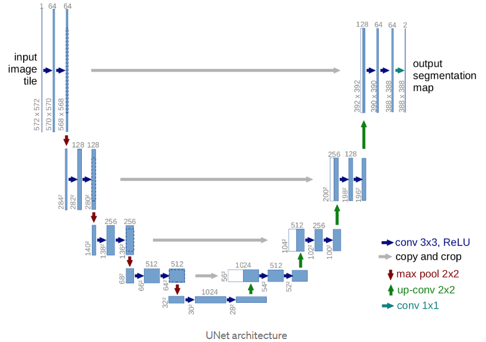

### Modeling Steps

-  **Data Curation**: First of all we have the MRI scanned image of the organ, and their respective RLE-encoded masks. To understand the data distribution, I created a data frame, which consists of three columns namely image_path, it's respective mask_path, and diagnosis. 
Here, if mask has a maximum pixel value greater than 0, I am flagging it as 1(Tumer), otherwise 0(no tumer).

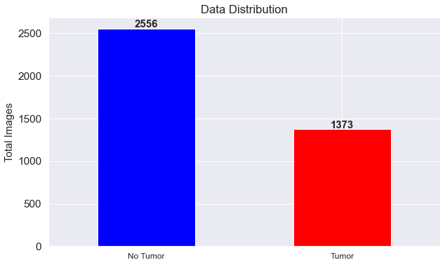

- **EDA**:  For understanding the images furtherm, I randomly selected 5 samples for tumer and no-tumer condition, which I assigned it as positive(tumer) and negative(no-tumer). 
    After that, I created a grid and plot the 5 images in the RGB format for the positive and the negative case.

<h4 align="center">Tumer</h4>
<figure>
  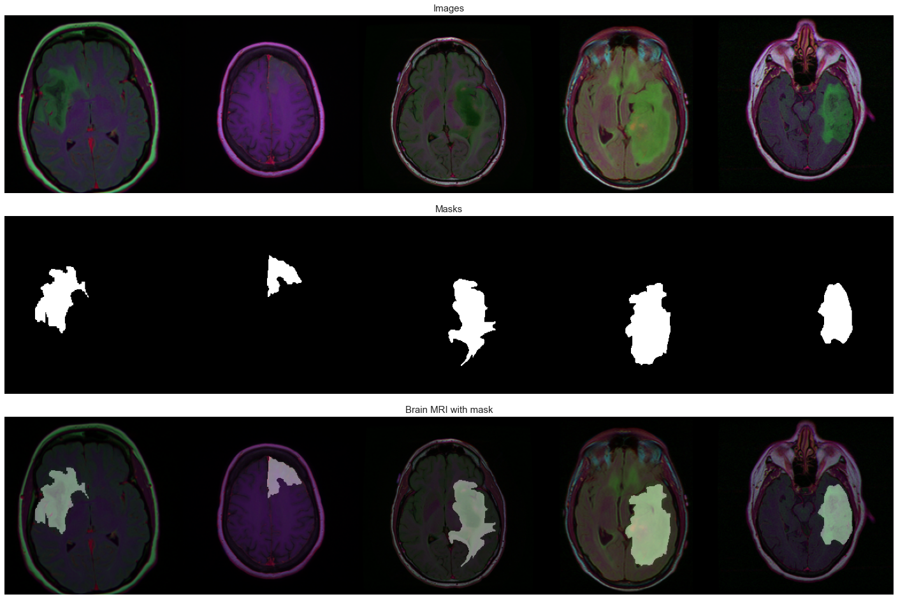
</figure>

<p></p>

<h4 align="center">No Tumer</h4>
<figure>
  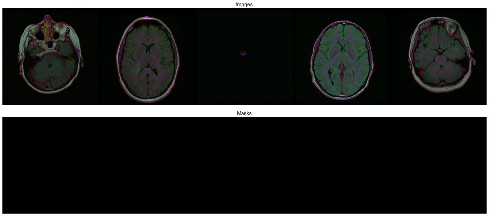
</figure>

- **Model**: Instead of going with general convolutional neural network, which focuses on image classification, where input is an image and output is a lable. However, in our case we are required to localize the area of abnormality. UNet is dedicated in solving this problem. 

    UNet is able to do image localisation by predicting the image pixel by pixel and the author of UNet claims in his [paper](https://arxiv.org/abs/1505.04597) that the network is strong enough to do good prediction based on even few data sets by using excessive data augmentation techniques.

    -   To optimze the model design, I create a class to divide the entire architecture into 'encoder' function, 'decoder' function, and the 'build' function. Inside the build class we can create multiple encoder and decoder blocks.

    - After reaching to the bottomost layer of U-Net architecture, we have to perform an expansion process, where the image is going to be upsized to its original size.

    ```
    conv_2d_transpose -> concatenate -> conv_layer1 -> conv_layer2
    ```
    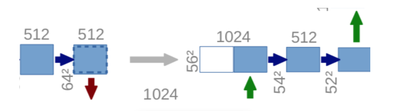

    - The l last layer is a convolution layer with 1 filter of size 1x1(notice that there is no dense layer in the whole network). And the rest left is the same for neural network training.
    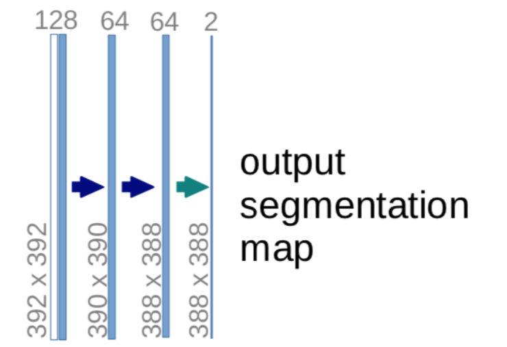


### Testing and Validations

-   After training the model, I analyzed the quality of prediction image. To do that, I have used   Intersection-Over-Union (IoU), also known as the Jaccard Index.

    IoU is the area of overlap between the predicted segmentation and the ground truth divided by the area of union between the predicted segmentation and the ground truth, as shown on the image to the left. This metric ranges from 0–1 (0–100%) with 0 signifying no overlap and 1 signifying perfectly overlapping segmentation.

    For binary (two classes) or multi-class segmentation, the mean IoU of the image is calculated by taking the IoU of each class and averaging them. (It’s implemented slightly differently in code).

    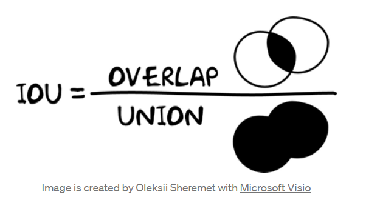

    If the prediction is completely correct, IoU = 1. The lower the IoU, the worse the prediction result.

    

- **Loss and Dice Coefficient**: Due to limited GPU's and out of memory issues, I went with 12 epochs. In real time scenario, I would like the network to learn more, therefore an epoch of 120 would be a good one.

    -   As, U-net architecture contains lots data and parameters, therefore to update all weights efficiently and computationally faster with a single learning rate, I went with *Adam*.

    -   For **loss function**, I went with *Dice-coefficient(DSC)* loss. It considers the loss information both locally and globally, which is critical for high accuracy.

    ```
    class Quality_metrics:

    def __init__(self, smooth):
        self.smooth = smooth

    def dice_coef(self, y_true, y_pred):
        y_true = K.flatten(y_true)
        y_pred = K.flatten(y_pred)
        intersection = K.sum(y_true * y_pred)
        union = K.sum(y_true) + K.sum(y_pred)
        return (2.0 * intersection + self.smooth) / (union + self.smooth)

    def dice_coef_loss(self,y_true, y_pred):
        return 1 - self.dice_coef(y_true, y_pred)

    def bce_dice_loss(self,y_true, y_pred):
        bce = tf.keras.losses.BinaryCrossentropy(from_logits=True)
        return self.dice_coef_loss(y_true, y_pred) + bce(y_true, y_pred)

    def iou(self, y_true, y_pred):
        intersection = K.sum(y_true * y_pred)
        sum_ = K.sum(y_true + y_pred)
        jac = (intersection + self.smooth) / (sum_ - intersection + self.smooth)
        return jac
    ```
    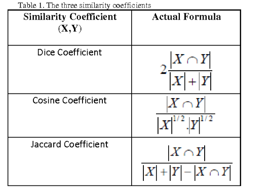

    - **Loss and validation plots**

    <center>

    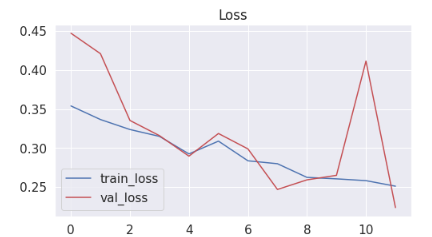 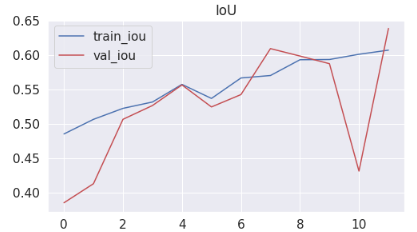 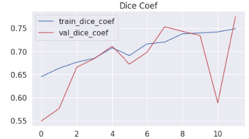

    </center>


### Conclusions

After Validating it with the test data, I found out U-net is highly efficient in locating the area of abnormality with a high segmentation accuracy. The model has delivered 99% IOU and 63.28% of dice coefficient on test data. It can be further improved by increasing the epochs.

Below are the sample prediction:

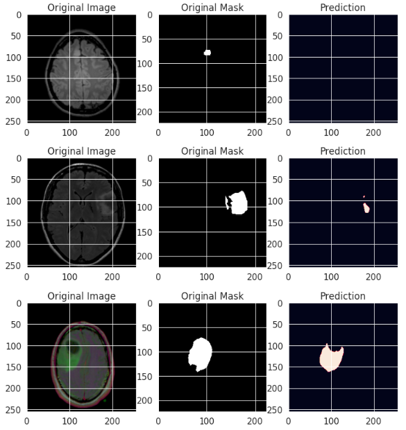


    